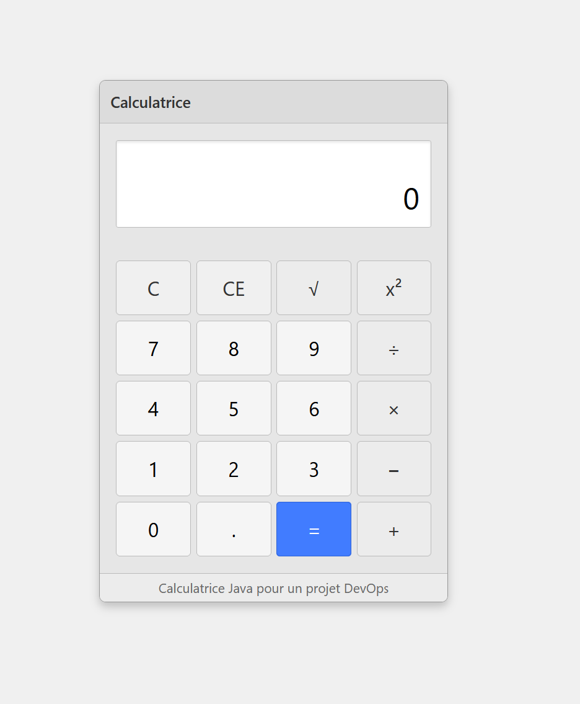

# Calculatrice Spring Boot avec Interface Web

Ce projet est une application de calculatrice qui combine une API REST Spring Boot avec une interface utilisateur en HTML/CSS/JavaScript.
Ce projet est utilisé dans le cadre d'un pipeline CI/CD avec Jenkins.

## Fonctionnalités de la calculatrice

### API REST
- Opérations mathématiques de base : addition, soustraction, multiplication, division
- Opérations avancées : puissance, racine carrée
- Gestion des erreurs (division par zéro, racine carrée de nombre négatif)

### Interface Web
- Calculatrice accessible via une page HTML simple
- Opérations de base et avancées
- Interface utilisateur responsive
- Gestion des erreurs avec affichage visuel

## Prérequis

- Java JDK 17 ou supérieur
- Maven 3.6 ou supérieur
- Jenkins (pour le pipeline CI/CD)

## Structure du projet

```
src/
├── main/
│   ├── java/
│   │   └── com/
│   │       └── example/
│   │           └── calculatrice/
│   │               ├── CalculatriceApplication.java
│   │               ├── config/
│   │               │   └── WebConfig.java
│   │               ├── controller/
│   │               │   └── CalculatriceController.java
│   │               │   └── HomeController.java
│   │               └── service/
│   │                   └── CalculatriceService.java
│   └── resources/
│       └── static/
│           └── index.html
│       └── application.properties
├── test/
│   └── java/
│       └── com/
│           └── example/
│               └── calculatrice/
│                   ├── CalculatriceApplicationTests.java
│                   ├── controller/
│                   │   └── CalculatriceControllerTests.java
│                   └── service/
│                       └── CalculatriceServiceTests.java
└── pom.xml
```

## Compilation et exécution

### Via Maven

```bash
# Compiler le projet
mvn clean compile

# Exécuter les tests
mvn test

# Créer le package JAR
mvn package

# Exécuter l'application
mvn spring-boot:run
```

### Via Jenkins

Le projet inclut un `Jenkinsfile` qui configure un pipeline CI/CD complet avec les étapes suivantes :
- Checkout du code source
- Compilation
- Tests unitaires
- Analyse de couverture de code avec JaCoCo
- Packaging
- Analyse statique de code avec SonarQube
- Déploiement vers les environnements de développement et production

### Visuel du pipeline CI/CD


## Capture d'écran


